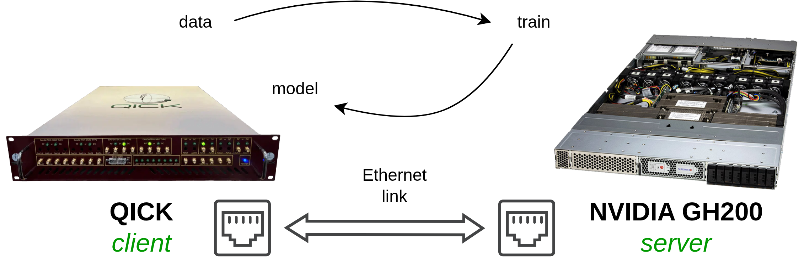

# FastTrain 🚂

<p align="center">
  
  
</p>

## Quick Start

```bash
# Install dependencies
pip install tensorflow fastapi uvicorn scikit-learn numpy requests

# Start server
python server.py
# or
make server

# Run client (in another terminal)
python client.py
# or
make client

# Clean directory
make clean
```

